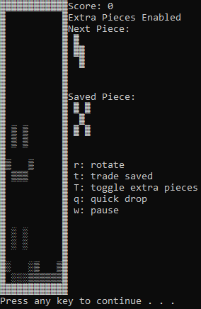

# Tetris



# FAQ
* [What is Tetris?](https://en.wikipedia.org/wiki/Tetris)(Ctrl + click) the link
* Does this work on Linux?
    - Sadly no, due to libraries used in the code.
* Does this work on Windows
    - Yes, below instructions are provided.

# Install for windows
1. Download zip to Downloads
2. Unzip Tetris-master
    * right-click & extract all in the same location
3. [gcc/g++ Compilers (used to compile and play)](https://iweb.dl.sourceforge.net/project/tdm-gcc/TDM-GCC%20Installer/tdm64-gcc-5.1.0-2.exe)(Ctrl + click) the link
    * run & install
    * Video on how to install the compilers [Compiler Installation Tutorial](www.youtube.com/vhgww2hvyq9jpyp)(Ctrl + click) the link
    * If you have installed them once, you don't need to again
4. Press together: ```Win + R```
5. type & enter: ```cmd```
6. type & enter: ```cd Downloads``` to **c**hange **d**irectory to your Downloads
7. type & enter: ```cd Tetris-master```
8. Once more type & enter: ```cd Tetris-master```
9. type & enter: ```g++ main.cpp -o run```
10. Read ```How to play``` before playing
11. type & enter: ```run```

# How to play  
1. **Movement**:
    * There are two sets of movement controls
        - w,a,s,d: pause, left, down, right
        - r: rotate
        - (space) or q: instant place/drop
    * and
        - (up arrorw): rotate
        - (left arrow): left
        - (down arrow): down
        - (right arrow): right
2. **Extra Stuff**
    * t: save/swap pieces
    * T: toggle extra pieces
3. **Cheats**
    * W: clear board
    * F: move all individual blocks down if nothing below them
4. **More info**
    * There are two extra pieces
        - Smile
        - X
